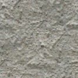

# Max Anderson - RDSI Capstone 3
 
 ## CLASSIFYING TEXTURE IMAGES WITH CNNS & GENERATING NEW TEXTURE IMAGES WITH VARIABLE AUTOENCODERS

### PROJECT DESCRIPTION
- Attempt to refine last Capstone project:
   - Using Convolutional Neural Networks in order to classify image textures from Nintendo 64 games by use in game development or game modding.
- Use pre-trained CNNs to accurately classify CC0 or open source image textures across a variety of common useful categories
- Data was hand labeled into what I consider to be the most useful categories based on personal experience and input from game dev communities
- Compare new pre-trained models to ResNet-34 model used in last Capstone to track improvement
- Use a variational autoencoder to generate new image textures based on the most accurate predicted images per category from the best performing CNN model

### IMAGE TEXTURES

[Wiki article on texture images](https://en.wikipedia.org/wiki/Image_texture)

- 2D color image texture:
   

- "Wrapped" around 3D object:
   

### DATA ORGANIZATION
- Around 1,500 .png and .jpg images were taken from polyhaven.com, ambientcg.com and opengameart.org
- Most images were 1024x1024 pixels in RGB colorspace
- Images were successfully labeled into 6 categories:
   - Fabric
   - Masonry
   - Metal
   - Stone/Plaster
   - Terrain
   - Wood

### MODEL DESCRIPTIONS
- In order to address the unbalanced nature of the the hand-labeled image sets, pre- trained models were used with weights inherited from the standard image dataset ImageNet
- Several models were attempted including: ResNet 50, Inception, Xception and ResNet34
- ResNet34 model was the best performing model on last attempt at texture image classification
- Xception model was the most accurate by far

### ACCURACY SCORES

- Xception val accuracy: 0.82
- Inception val accuracy: 0.36
- ResNet50 val accuracy: 0.38
- ResNet34 val accuracy: 0.49

### XCEPTION CONFUSION MATRICES
- Not Normalized:
   
- Normalized:
   

### VARIABLE AUTOENCODER
- Encoded the 5 most confident, accurately predicted image for each category
- Replaced the first input of the encoded matrix with a random sample
- Decoded the new “randomized” matrix
- Repeated several times for each category
- Most confident, accurate predicitons per category:
   

### VAE GENERATED IMAGES
- Fabric:

   
   
   
   

- Masonry:

   
   
   
   

- Metal:

   
   
   
   

- Stone:

   
   
   
   

- Terrain:

   
   
   
   

- Wood:

   
   
   
   

### NEXT STEPS
- Improve other CNN models
- Gather more data
- Attempt to generate images with GANs
- Assess usefulness for auto-generated image textures

### Initial Project Proposals 
1. **Image Texture Classification and Generation:** I would really like to refine and extend my capstone 2 project: classifying image textures used for 3D modeling. After my classifier failed to make predictions with much accuracy, I've rethought my approach. I would like to use an open source data set with better thought out labels, more labeled images, and perform training on a transfer learning algorithm. I also plan on basing my labels off of a more conventional standard based on some conversations with various game devs. After classification is complete, I would like to build some sort of simple generator that would attempt to make new, unique image textures for use.
   - [Open source textures](https://opengameart.org/)
   - [Labels basis](https://www.textures-resource.com/) 
2. **Collage Image Classification:** I work for an artist who is heavily based in collage. He apparently has a lot of images of cut outs from magazines, etc. scanned in. I have no idea how they're organized but, since I have to access them at some point, I would like to build a model that could classify images based on their subject matter and use. For example, classifying something as an animal, and knowing it belongs with other images that often occupy the same areas of the collages. I don't have eyes on the data right now, but I'm meeting with the artist and his staff this week and can bring it up then.
3. **Sample Generator:** My last proposal is to build a model for audio processing based on the *Spectrasonics Distorted Reality* sample pack that I already own. This sample pack was used widely in horror games and movies in the late 90's and early 2000s and has seen something of a rediscovery lately. I would like to attempt to build a generator that would create new samples in the style of the *Distorted Reality* pack that would be more accessible to sound designers and musicians as the original pack is somewhat hard to find and expensive.
   - [Distorted Reality](https://www.spectrasonics.net/products/legacy/distortedreality1.phps)